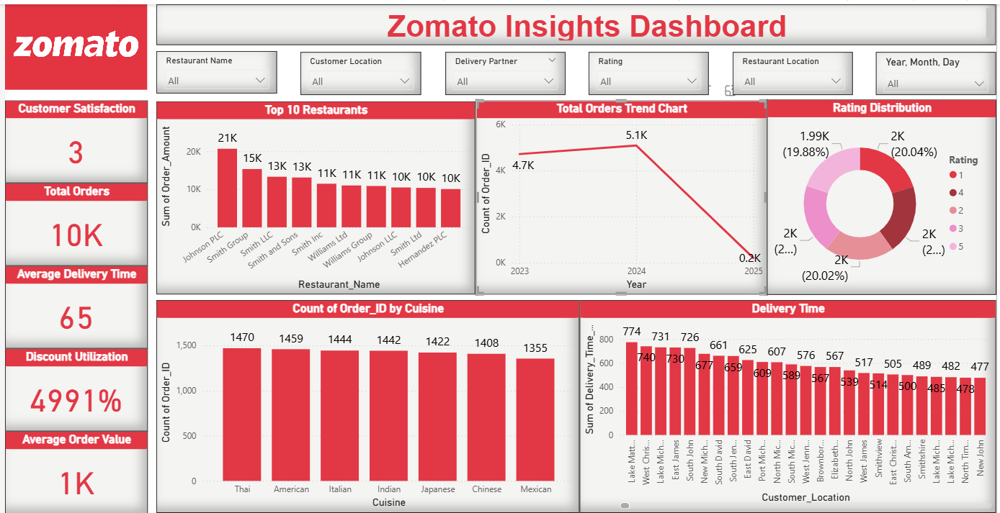

# Zomato-Insights-Dashboard  

#Project Overview  
This project analyzes Zomato restaurant data to identify trends in customer preferences, pricing patterns, ratings, and city-wise performance. The goal is to generate business insights that can help restaurants and food platforms improve customer satisfaction and revenue.

 # Problem Statement
Analyzed 9,000+ restaurant records from Zomato to uncover trends in pricing, ratings, and location performance to support data-driven business decisions.

# Dataset Information  
- Restaurant data including city, cuisine, ratings, cost, and online delivery  
- Multiple cities covered  
- Key focus areas: Ratings, Price Range, Online Delivery, and Popular Cuisines  
- *Dataset Source:*Zomato Restaurant Dataset  

# Tools Used  
- Power BI / Excel / SQL  (jo tumne use kiya ho woh edit karna)  
- Data Cleaning  
- Data Transformation  
- Data Visualization  
- Business Insight Generation  

# Key Insights  
- Certain cities generate higher restaurant density and customer engagement.  
- Restaurants offering **Online Delivery** tend to attract more customers.  
- Popular cuisines vary across cities.  
- Higher price range restaurants do not always guarantee higher ratings.  
- Ratings distribution shows most restaurants fall between average rating bands.

# Business Recommendations  
- Focus on expanding popular cuisines in high-demand cities.  
- Encourage online delivery services for better reach.  
- Improve service quality to increase average ratings.  
- Analyze mid-range pricing strategies for higher customer retention.

# My Role  
- Data Cleaning  
- Data Analysis  
- Dashboard Development  
- Insight Generation  

# Note  
This project was developed as part of my self-learning journey in Data Analytics by referring to online resources and independently creating the dashboard.
